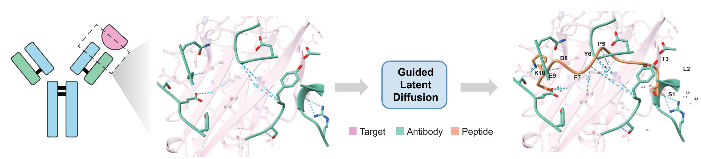

# Peptide Mimicry



## Running Locally

### Environment

:warning: The codes are tested under cuda 11.7.

```bash
conda env create -f env.yaml
conda activate pepmimic

# install pyrosetta
pip install pyrosetta-installer
python -c 'import pyrosetta_installer; pyrosetta_installer.install_pyrosetta()'
```

:warning: You need to further manually setup FoldX5 suite by acquiring an [academic license](https://foldxsuite.crg.eu/academic-license-info). The suite should be downloaded and extracted under `evaluation/dG/foldx5`:

```bash
evaluation/dG/foldx5/
├── foldx_20251231
├── molecules
└── yasaraPlugin.zip
```

The suffix "20251231" denotes the last valid day of usage (2025/12/31) since foldx only provide 1-year license for academic usage and thus needs yearly renewal. After renewal, the path in `globals.py` also needs to be changed according to the new suffix.

### Checkpoints

The model weights can be downloaded at the [release page](https://github.com/kxz18/PepMimic/releases/download/v1.0/checkpoints.zip).

```bash
wget https://github.com/kxz18/PepMimic/releases/download/v1.0/checkpoints.zip
unzip checkpoints.zip
```

### Mimicking Given References

Prepare an input folder with reference complexes in PDB format, an index file containing the chain ids of the target protein and the ligand, as well as a configuration indicating parameters like peptide length and number of generations. We have prepared an example folder under `example_data/CD38`:

```bash
example_data/
└── CD38
    ├── 4cmh.pdb
    ├── 5f1o.pdb
    ├── config.yaml
    └── index.txt
```

Here we also illustrate the meaning of each entry in the `config.yaml`:

```yaml
dataset:
  test:
    class: MimicryDataset
    ref_dir: ./example_data/CD38    # The directory for all reference complexes, which should be a relative path rooted at the project folder, or a absolute path
    n_sample_per_cplx: 20           # The number of generations for each reference complex. This is just a toy example for a quick tour. For practical usage, we recommend generating a total of above 100,000 candidates before ranking to select the top-scoring one for wetlab tests. For example, here we have two reference complexes, thus we should set n_sample_per_cplx to at least 50,000, so that the total generations will be above 100,000.
    length_lb: 10                 # lower bound of peptide length (inclusive)
    length_ub: 12                 # uppper bound of peptide length (inclusive)

dataloader:
  num_workers: 4                  # Number of CPUs for data processing. Usually 4 is enough.
  batch_size: 32                  # If the GPU is out of memory, please try to reduce the batch size
```

Each line of `index.txt` describes the filename (without `.pdb`), the target chains, the reference ligand chains, and custom annotations for a reference complex, separated by `\t`. The custom annotations only work as reminders for yourself, since the program will not access this content. For example, the line for `4cmh.pdb` looks like:

```
4cmh	A	B,C	HEAVY CHAIN OF SAR650984-FAB FRAGMENT,LIGHT CHAIN OF SAR650984-FAB FRAGMENT
```

After preparation of these input files, you can try the generation with the following script:

```bash
# The last number 10 indicates we will finally select the best 10 candidates as the output
GPU=0 bash scripts/mimic.sh example_data/CD38 10
```

The results will be saved under `example_data/CD38/final_output`.

:warning: Note that for practical use, we recommend adjusting `n_sample_per_cplx` to at least **100,000** to let the model explore enough space before final selection. And also, from the experience in our experiments, the Rosetta and FoldX energy does not always rank the positive ones to the top, so it is recommended to synthesize **top 100 - 300** peptides for wetlab validation.


## Running on Google Colab
<a href="https://colab.research.google.com/drive/1ji_52YZjaqZnsGbvKD9hqjFOHa2Q1CV-?usp=sharing">
  
</a> <br />

We have also prepared the online version for users who prefer using Google Colab. However, we still recommend using the local version due to various constraints on Google Colab (e.g. Running time restriction).


## Training on Custom Datasets

Here we provide the example using the [PepBench](https://zenodo.org/records/13373108) datasets to train our model, which is the same setting as in our paper. The benchmark includes two datasets:
- **train_valid**: Training/validation sets of protein-peptide complexes between 4-25 residues extracted from PDB.
- **ProtFrag**: Augmented datasets from pocket-peptide-like local contexts of monomer structures.

### 0. Preliminary: structure of datasets

Take the `ProtFrag` dataset as an example, we can see that each dataset has the following structure:

```bash
ProtFrag/
├── all.txt     # an index file
└── pdbs        # all protein-peptide complexes with *.pdb
    ├── xxxxxx.pdb
    ├── yyyyyy.pdb
    ├── zzzzzz.pdb
    ...
```

Each line of the index file `all.txt` records the information of each complex, including file name (without extension), target chain ids, peptide chain id, and whether the peptide has non-standard amino acid (optional), separated with `\t`:

```bash
pdb7wtk_0_11    R       L       0   # file name, target chain ids, peptide chain id, has non-standard amino acid, separated by \t. Our data processing does not read the last column, so it can be dropped when you are composing your own all.txt.
```

You can also provide custom splits by putting the information of complexes into different index files, just like the `train.txt` and the `valid.txt` in the `train_valid` dataset. Clustering files are also supported as the `train/valid.cluster` in the `train_valid` dataset, following the format of file name, cluster name, and cluster size separated by `\t`:

```bash
# contents of train_valid/train.cluster
A_K_pdb4wjv     A_K_pdb4wjv     2
D_J_pdb4wjv     A_K_pdb4wjv     2
A_B_pdb5yay     A_B_pdb5yay     2
B_D_pdb5ybv     A_B_pdb5yay     2
B_C_pdb2drn     B_C_pdb2drn     4
D_F_pdb2hwn     B_C_pdb2drn     4
B_C_pdb2izx     B_C_pdb2drn     4
A_E_pdb2hwn     B_C_pdb2drn     4
...
```

During training, if the cluster file is provided, the dataset will resample complexes by cluster size, to make the frequency of each cluster equal with each other.

### 1. Download the process the raw data

```bash
mkdir datasets  # all datasets will be put into this directory

# download
wget https://zenodo.org/records/13373108/files/train_valid.tar.gz?download=1 -O ./datasets/train_valid.tar.gz   # training/validation
wget https://zenodo.org/records/13373108/files/ProtFrag.tar.gz?download=1 -O ./datasets/ProtFrag.tar.gz     # augmentation dataset

# decompress
tar zxvf ./datasets/train_valid.tar.gz -C ./datasets
tar zxvf ./datasets/ProtFrag.tar.gz -C ./datasets
```

Next we need to process the dataset to the data structure (mmap) recognized by our training framework:

```bash
python -m scripts.data_process.process --index ./datasets/train_valid/all.txt  --out_dir ./datasets/train_valid/processed  # train/validation set
python -m scripts.data_process.process --index ./datasets/ProtFrag/all.txt --out_dir ./datasets/ProtFrag/processed # augmentation dataset
```

For training and validation sets, we need to get the split index for mmap, which will result in `datasets/train_valid/processed/train_index.txt` and `datasets/train_valid/processed/valid_index.txt`:

```bash
python -m scripts.data_process.split --train_index datasets/train_valid/train.txt --valid_index datasets/train_valid/valid.txt --processed_dir datasets/train_valid/processed/
```

### 2. Training with scripts

We have provided a script pipelining each training stage in `./scripts/run_exp_pipe.sh`, which can be used as follows:

```bash
GPU=0 bash scripts/run_exp_pipe.sh \    # set gpu id with the environment variable GPU, in our experiment, we use a 24G GPU for training
  demo_pepmimic \                       # <name>: name of your experiment. Results will be saved to ./exps/<name>
  ./configs/train_autoencoder.yaml \    # <AE config>: Config for training the all-atom variational autoencoder
  ./configs/pretrain_ldm.yaml \         # <LDM pretrain config>: Config for pretraining latent diffusion model on augmentation datasets
  ./configs/train_ldm.yaml \            # <LDM config>: Config for finetuing the latent diffusion model on high-quality datasets
  ./configs/train_ifencoder.yaml \      # <interface encoder config>: Config for training the latent interface encoder, which will be used as mimicry guidance
  1111                                  # <mode>: four digits to indicate whether to train AE/pretrain LDM/finetune LDM/train interface encoder. Usually it should be 1111.
```

In the example above, we train the all-atom autoencoder on both `train_valid` and `ProtFrag`. Then we pretrain the latent diffusion model on the augmented dataset (ProtFrag), and finetune it on the high-quality dataset (train_valid). Finally, we train the latent interface encoder on both `train_valid` and `ProtFrag`. The finished checkpoint will be located at `./exps/demo_pepmimic/model.ckpt`.


## Citing this Work

If you find the work useful, please cite our paper as:

```bibtex
@article{kong2025peptide,
  title={Peptide design through binding interface mimicry with PepMimic},
  author={Kong, Xiangzhe and Jiao, Rui and Lin, Haowei and Guo, Ruihan and Huang, Wenbing and Ma, Wei-Ying and Wang, Zihua and Liu, Yang and Ma, Jianzhu},
  journal={Nature Biomedical Engineering},
  pages={1--16},
  year={2025},
  doi={10.1038/s41551-025-01507-4}
}
```